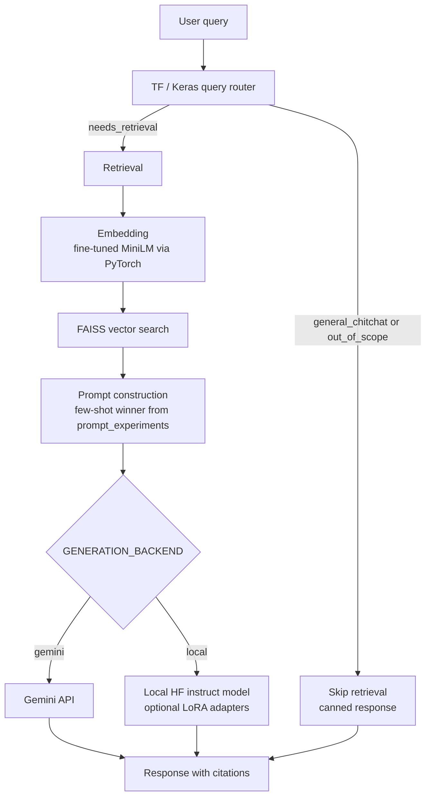

# Document Parser – PDF Chat RAG

A retrieval-augmented chat app for PDFs. A TensorFlow query router decides whether a question needs the document; if it does, fine-tuned MiniLM embeddings retrieve chunks from FAISS, a few-shot prompt is built, and either Gemini or a local Hugging Face model (optional LoRA) generates a cited answer.

## Architecture



Indexing (upload) is the other half of the pipeline: PDF text is chunked, embedded with the same encoder, and stored in FAISS with page metadata so citations can point back to the source.

## Tech stack

| Layer | Libraries |
|---|---|
| API | FastAPI, Uvicorn |
| Frontend | Next.js |
| Retrieval | FAISS, sentence-transformers, **PyTorch** |
| Embeddings | **sentence-transformers** (`all-MiniLM-L6-v2`, optional fine-tuned checkpoint) |
| Query routing | **TensorFlow** / Keras text classifier |
| Generation | Gemini API, or **Hugging Face transformers** + **peft (LoRA)** |
| PDF / chunking | PyMuPDF, LangChain text splitters |

## Model Development

### Why LoRA instead of full fine-tuning

Full fine-tuning of an instruct model (Phi-3-mini or similar) updates every weight. That is expensive in GPU memory, slow on CPU, and easy to overfit on a small PDF-derived QA set. LoRA (`peft`) freezes the base model and trains low-rank adapters on attention/MLP projections only. Adapters save to `./models/lora-adapter` and attach at inference when `USE_LORA_ADAPTER` is set or the directory exists. The base checkpoint stays reusable; swapping or disabling adapters does not require retraining the whole LLM.

### Why MiniLM, and why fine-tune it

`all-MiniLM-L6-v2` is a 384-dimensional sentence encoder: small enough to run locally, trained for semantic similarity, and a standard default for RAG. Off-the-shelf MiniLM does not know this corpus (Kubernetes/EKS, DocuMind, Event-Connect, Unity interview). Fine-tuning with MultipleNegativesRankingLoss on synthetic query–chunk pairs from the indexed PDF pulls those domain phrases closer in vector space. Switch with `USE_FINETUNED_EMBEDDINGS=true` (weights in `./models/finetuned-embeddings`). Re-index after changing encoders; Gemini and MiniLM vectors are not interchangeable.

### Why the TensorFlow router is separate from the LLM

Routing is a three-way classification (`needs_retrieval`, `general_chitchat`, `out_of_scope`), not generation. A ~100K-parameter Keras embedding + dense model answers that in milliseconds without an API call or loading Phi-3. Keeping it off the LLM avoids burning generation quota on “thanks” / “what’s the weather”, and lets retrieval+generation stay specialized for document questions. Decisions are logged to `data/router_decisions.jsonl`. Disable with `USE_QUERY_ROUTER=false`.

## Results

### Base vs fine-tuned embeddings (top-5 hit rate)

Eval set: 18 document questions, 513 corpus chunks. A hit means an expected keyword appears in the top-5 retrieved chunks.

| Encoder | Top-5 hits | Hit rate |
|---|---:|---:|
| Base MiniLM (`all-MiniLM-L6-v2`) | 13 / 18 | 72.22% |
| Fine-tuned MiniLM | 15 / 18 | **83.33%** |
| Delta | +2 | **+11.11 pp** |

### Prompt strategy comparison

Same retrieved context, three generation templates. Gemini free-tier quota limited the run to **7 of 18** questions where all three strategies returned a real answer. Accuracy = expected keyword in the final answer; groundedness = answer content supported by retrieved context (or a refusal).

| Strategy | Accuracy | Groundedness | Combined | Avg latency |
|---|---:|---:|---:|---:|
| plain | 100% (7/7) | 100% (7/7) | 100% | 1.75s |
| **few_shot** (default) | **100% (7/7)** | **100% (7/7)** | **100%** | **1.21s** |
| chain_of_thought | 100% (7/7) | 100% (7/7) | 100% | 2.44s |

Quality tied; **few_shot** won on latency and is the pipeline default (`PROMPT_STRATEGY` overrides). Full tables: `pdf-chat-rag/backend/eval/prompt_comparison.md`.

### Gemini vs local Hugging Face generation

| Backend | How to select | Output quality (eval set) | Notes |
|---|---|---|---|
| **Gemini** (`gemini-2.5-flash`) | `GENERATION_BACKEND=gemini` (default) | Few-shot: 100% accuracy and groundedness on the 7 comparable prompt-eval questions. Full 18-query RAG harness: 100% retrieval hit rate; 38.9% keyword groundedness on an earlier end-to-end run. | Strong instruction following; subject to API quota. |
| **Local HF + LoRA** | `GENERATION_BACKEND=local` and `POST /chat?backend=local`; adapters from `./models/lora-adapter` | Not scored on the 18-query set (Phi-3-mini is large; Gemini quota was exhausted before a side-by-side run). | Offline, no generate quota; quality depends on the instruct checkpoint and LoRA data. Expected: more refusals / shorter answers than Gemini on the same few-shot prompt. |

Re-run a head-to-head later with `python prompt_experiments.py <doc_id> --backend local` vs `--backend gemini`.

## Quick start

From the **Document Parser** folder:

```bash
npm start
```

This will:

1. Free ports 8000 and 3000 if something is already using them  
2. Start the **backend** (FastAPI) in a new window → http://127.0.0.1:8000  
3. Start the **frontend** (Next.js) in a new window → http://127.0.0.1:3000  
4. Open your browser at **http://127.0.0.1:3000**

Two terminal windows will stay open (backend and frontend). Close them when you’re done.

## Alternative: run the script directly

From the **Document Parser** folder:

```powershell
powershell -ExecutionPolicy Bypass -File .\pdf-chat-rag\start.ps1
```

Or from inside **pdf-chat-rag**:

```powershell
.\start.ps1
```

## Requirements

- **Backend:** Python with a virtual environment at `pdf-chat-rag\backend\.venv` and dependencies installed (`pip install -r pdf-chat-rag/backend/requirements.txt`)  
- **Frontend:** Node.js; run `npm install` once in `pdf-chat-rag/frontend` if you haven’t  
- Optional env flags: `USE_FINETUNED_EMBEDDINGS`, `GENERATION_BACKEND=gemini|local`, `USE_LORA_ADAPTER`, `USE_QUERY_ROUTER`, `PROMPT_STRATEGY`

The app uses **http://127.0.0.1** (not localhost) to avoid connection issues on Windows.

## If the frontend says "Failed to connect to the server"

The backend may not be running. Start it manually:

**Option 1 – double‑click:**  
`pdf-chat-rag\backend\start-backend.bat`

**Option 2 – terminal:**

```powershell
cd "d:\Projects\Document Parser\pdf-chat-rag\backend"
.\.venv\Scripts\Activate.ps1
python main.py
```

Leave that window open. When you see `Uvicorn running on http://0.0.0.0:8000`, refresh the app in the browser.
